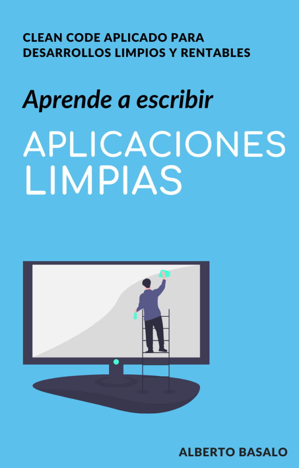
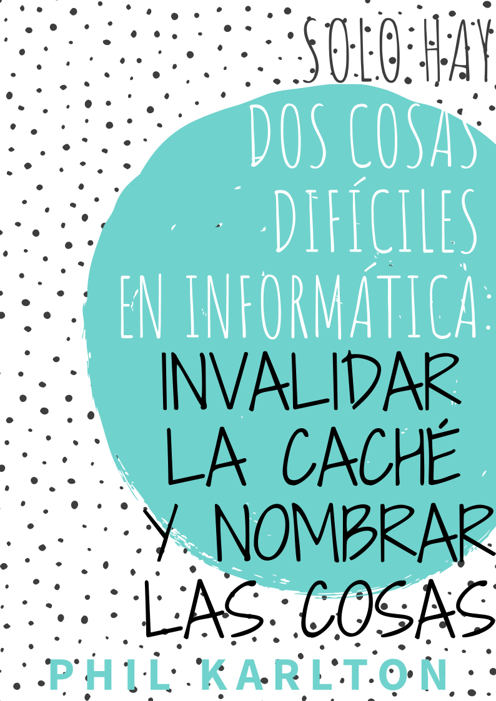
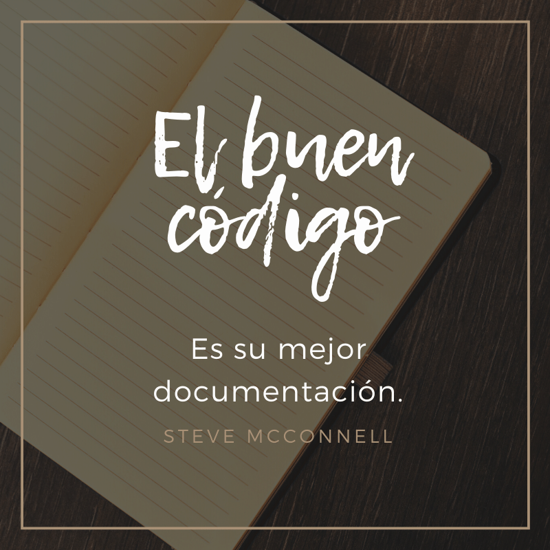
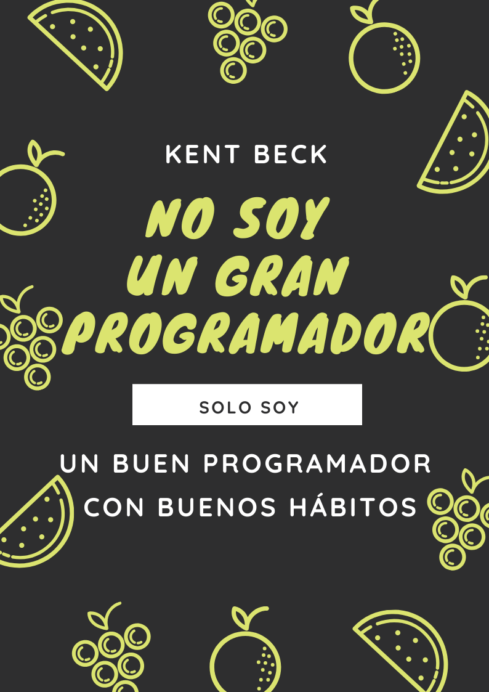
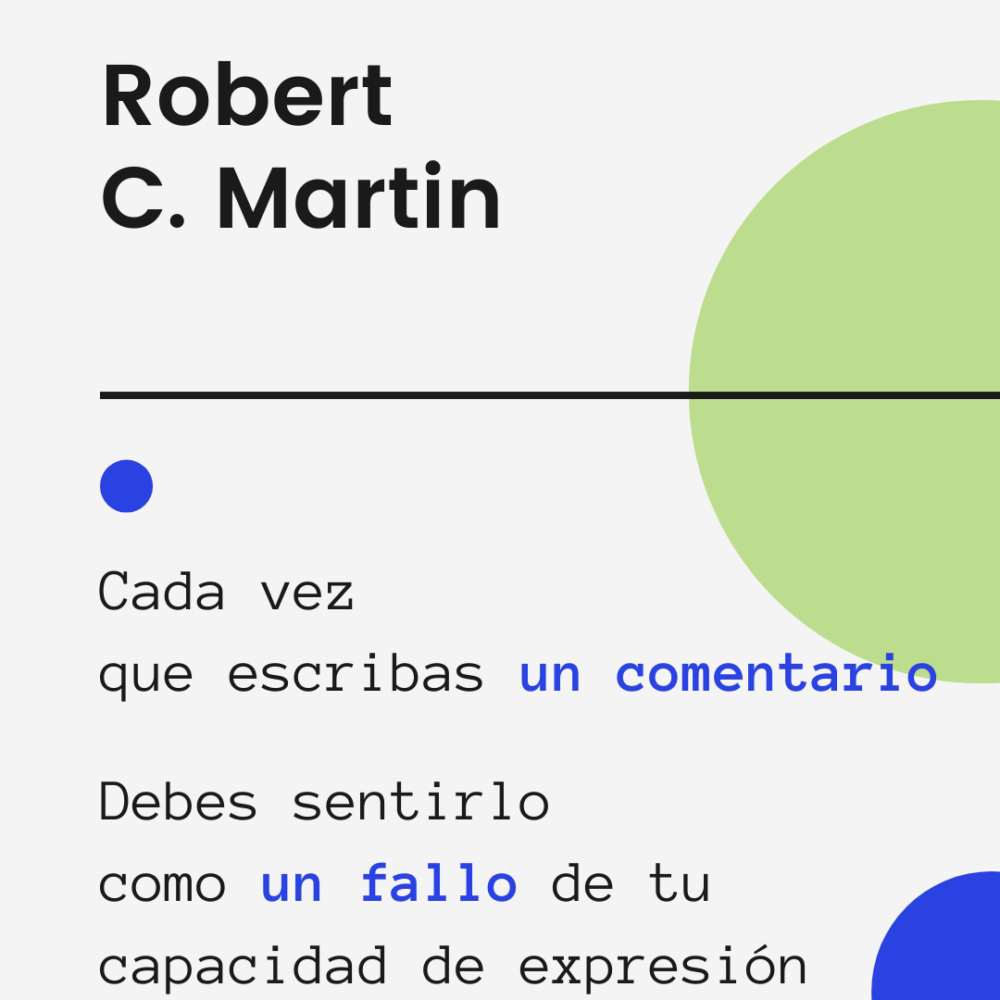
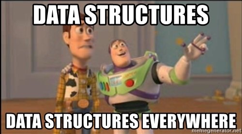

<div class="page"/>

# Clean Code

## Aprende a escribir aplicaciones limpias y aumenta tu valor.

### Por [Alberto Basalo](https://www.linkedin.com/in/albertobasalo)

#### Para [bitAdemy](https://www.bitademy.com)

##### Soporte del curos online:

[Clean Code aplicado para desarrollos limpios y rentables](https://www.bitademy.com/cursos/clean-code-aplicado-para-desarrollos-limpios-y-rentables/)

<div class="page"/>

# 📚 índice de contendido

#### Clean Code aplicado para desarrollos limpios y rentables.

## 🏁 0 - Introducción.

#### 🤢 0.1 - Perdona pero... tu código huele

#### ✅ 0.2 - Software que funciona

## 🏷️ 1 - Estilo y nombrado

#### ✨ 1.1 - Estilo y orden

#### 📏 1.2 - Tamaños y límites

#### 📫 1.3 - Definiciones con sustantivos

#### 💪 1.4 - Acciones con verbos

## 🔀 2 - Instrucciones, bloques y funciones

#### 👉 2.1 - Declaración, asignación e invocación

#### ➰ 2.2 - Estructuras repetitivas y condicionales

#### 🧩 2.3 - Funciones puras y métodos de clase

## 🗂️ 3 - Estructuras de datos.

#### 🗃️ 3.1 - Cohesion de primitivos

#### 🔱 3.2 - Condiciones y algoritmos

## 📦 4 - Objetos y lógica de negocio

#### 🧱 4.1 - Cohesión de funciones

#### ⚒️ 4.2 - Principios sólidos para finales flexibles

## ✒️ 5 - Artesanía del software.

#### 📝 5.1 - Hacer las cosas bien

#### ✒️ 5.2 - Disciplina y buenos hábitos

<div class="page"/>


<div class="page"/>

# 0 - Introducción

## Aprende a escribir aplicaciones limpias y aumenta tu valor.


> _"Los programas deben escribirse para que la gente los lea, y de paso para que las máquinas los ejecuten."_
>
> ✍🏼 Harold Abelson

Inicio mis cursos preguntando a los alumnos **¿Para quién escribes código?**. Asistiendo a un curso sobre Código Limpio y haciendo yo hincapié en el _quién_ de la pregunta se cuidan de contestar lo que muchos piensan: ~~_el código se escribe para un ordenador_~~.

Pero si fuese así, **¿Qué sentido tienen los diversos lenguajes de programación?** ¿Por qué hay tantos? ¿Por qué han evolucionado desde el bajo nivel del código máquina hasta los actuales lenguajes de alto nivel?

La respuesta a estas preguntas quedaría mucho más clara si hubiéramos hecho una mejor traducción al español de la palabra original inglesa <mark>language</mark>. Deberíamos referirnos a Java, PHP, C#, JavaScript como idiomas. De ese modo resultaría más natural decir que **_el código se escribe para una persona._**

Por supuesto que **también escribimos para las máquinas**. Pero esa es la parte fácil, porque ellas se encargan de decirte alto y claro que no entienden lo que escribes o que directamente es incorrecto.

Pero si aceptamos que inicialmente escribimos para personas, entonces cobrará sentido dedicar tiempo al estilo con el que escribimos. Y lo más importante, esforzarnos para hacernos entender por nuestros lectores. Esta es la clave del código limpio: **escribir pensando en el lector**.

Sobre todo porque casi siempre tu principal lector será tu yo del futuro.

## 🏁 Empezamos

Voy a dejarte unas instrucciones en un idioma humano para que las sigas y escribas mejor código.

1 - **Programar es expresar procesos con detalle en un lenguaje no ambiguo** que entiendan las máquinas.

2 - Pero también es **comunicar a otras personas la intención** de los procesos para ser corregidos, aumentados y mejorados.

3 - Las **técnicas de código limpio** ayudan a escribir programas sencillos de entender y evolucionar.

4 - La programación limpia es un arte que **se puede aprender y practicar.**

5 - En este **curso tutorial** te enseño las técnicas para escribir código fácil de leer y barato de mantener.

Pero las ventajas de escribir código limpio no terminan en el propio código. Adquirir **la disciplina para escribir código limpio te convierte en mejor profesional**. En un artesano o artesana del software.

> _"El código limpio parece escrito por alguien que se preocupa."_
>
> -- ✍️ **Robert C. Martin**

<div class="page"/>


<div class="page"/>

# 🤢 0.1 - Perdona pero... tu código huele

## Lo primero es admitir que todo código es mejorable.

> _"Primero hazlo, después hazlo bien y luego hazlo mejor."_
>
> -- ✍️ **Addy Osmani**

He escogido esta frase para empezar porque me siento completamente representado. Casi nunca he hecho nada bien a la primera.

Pero se empieza por hacer algo. Ya vendrá el tiempo de corregirlo. Y cuándo esté bien será el momento de mejorarlo.

Este es un ciclo sin fin. **Hacer, corregir mejorar**. En este curso hablamos de la última parte, de la mejora de lo correcto.

Hacer las cosas bien es lo mínimo, es lo que se espera de cualquier profesional. Si se hacen mal te pedirán que las corrijas o te pedirán que te apartes.

Si continúas en este negocio es porque lo haces bien. Pero puedes hacerlo mejor.

### Tu código es mejorable; y el mío también. 😳

Así pues debemos tener claro que todo código es mejorable. No es cuestión de humildad o arrogancia. Es una cuestión práctica.

### A ese código mejorable le decimos que... huele mal. 🤢

Para no hablar en términos de bien o mal, la industria ha adoptado los sinónimos sucio y limpio. Y continuando con la metáfora decimos que el código sucio huele mal.


> Perdone, le huele el código.

## 🥀 Con el tiempo empeora

### El software de hoy exige mantenimiento futuro.

El software es la parte moldeable de un sistema. En contraposición con la rigidez del hardware, **creamos software con la intención de que pueda cambiar** con el tiempo. Y este es un concepto crucial.

### Con el paso del tiempo, digamos que el olor va a peor.

Es como si se pudriese. **Los malos olores del código son dificultades** para su entendimiento y modificación. Y el entendimiento de cualquier código se desvanece en cuanto te levantas de la silla.

> "Cualquier código tuyo que no hayas mirado últimamente, es como si lo hubiese escrito otro."
>
> -- ✍️ **Ley de Eagleson**

Puede que el código putrefacto no sea obra tuya. Pero, en cualquier caso, habrá que limpiarlo, ¿no? Permíteme este video para decirte lo mismo con algo de humor.

[ 📺 😂 ¿Lo he puesto yo? ¿Estaba aquí? ... ](https://twitter.com/quinHD/status/1087817606923542528?s=20)

## 💈 Principios de mejora

El hacer bien el código se apoya en la corrección formal que te ofrecen compiladores, editores u otras herramientas. El hacerlo correctamente se valida en los tests automáticos y en la validación por parte de los usuarios. Pero, **¿Cómo se evalúan las mejoras?.**

🛁 Toca limpiar el código pero no de cualquier manera. A lo largo del tutorial verás técnicas, métricas y consejos que seguirán estos **Principios de Limpieza**:

1️⃣. Mostrar la **intención** y ocultar los detalles.

2️⃣. **Evitar** la globalización y el acoplamiento.

3️⃣. Separar **responsabilidades**.

4️⃣. Don't Repeat Yourself **(DRY)**

_... and last but no least ..._

5️⃣. Keep It Simple, (_not_) Stupid **(KISS)**

Si lo que queremos es que el código se entienda, entonces nunca jamás debemos complicarlo. **Escoge la opción más sencilla** siempre vez que puedas . Ya el universo se encargará de aportar complejidad.

<div class="page"/>


<div class="page"/>

# ✅ 0.2 - Software que funciona

## Mejora tu código sin miedo.

> _"Codifica como si la persona que mantendrá tu código fuera un psicópata violento que sabe dónde vives."_
>
> -- ✍️ **Martin Golding**

Nos cuesta hacer las cosas. Y mucho más hacerlas bien. ¿Y ahora nos dicen que las mejoremos? Ni loco 😵. ~~_Si funciona no lo toques_~~.

Claro, si ese código nunca hubiera que cambiarlo... conque se comporte correctamente es suficiente. Pero **más temprano que tarde habrá que mantenerlo** (aumentarlo, modificarlo o corregirlo). Y entonces, al que venga detrás no le importará tanto la función como el diseño.

## 🧪 Limpiar requiere cambiar por dentro sin cambiar por fuera

Mejorar, o limpiar en este _argot_, significa **reescribir para facilitar la modificación futura**. Por tanto, el cambio es inapreciable desde fuera. Hay que verlo por dentro para valorarlo.

Estamos ante **los dos principales enemigos del software** bien diseñado. Tengo algo que funciona; no me pagan por mejorarlo y además tengo el riesgo de estropearlo.

Vamos a atacar al segundo con un arma de destrucción masiva de quejas: **los tests**. Las pruebas del software son la principal garantía de que su funcionamiento es correcto con respecto a las especificaciones.

Entiendo que hacer tests es costoso, aburrido y puede parecer improductivo. Pero **no hacerlos es más costoso**, resolver bugs en producción es más estresante y a la larga todo es más caro.

_No quiero hacer tests!!_ Vale, pero tampoco abandones tu camino hacia el código limpio si aún no estás convecino del valor de las pruebas. Puedes, y **debes, mejorar igualmente tu código**. Aunque asumirás más riesgos. Te propongo que empieces poco a poco, tal como nos recomiendan los expertos:

- Necesitas pruebas para limpiar **tranquilo**.
- Haz algún tipo de prueba, pero **¡haz pruebas!**.
- En _front_, mejor empieza por **integración**.
- Los tests **son automáticos**.
- Los tests **deben estar limpios**.

> "[Write tests. Not too many. Mostly integration.](https://kentcdodds.com/blog/write-tests)"
>
> -- ✍️ **Kent C. Dodds**

### Si funciona...

Todo **el código de muestra de este curso va acompañado de sus tests**. En los laboratorios tienes todo lo necesario para ejecutarlos. Tanto si ya eres un maestro del testing como si estás empezando puedes mejorar el código y hacer las prácticas propuestas con tranquilidad.


Tras la broma, una pequeña reflexión de despedida del padre del **Clean Code**.

> _"¿Por qué los desarrolladores temen cambiar su código?_
>
> Porque ¡Tienen miedo a que se rompa!
>
> _¿Por qué tienen miedo de romperlo?_
>
> Porque no tienen pruebas.
>
> _Si funciona, y tienes pruebas, tócalo."_
>
> -- ✍️ **Robert C. Martin**

<div class="page"/>



<div class="page"/>

# 🏷️ 1 - Estilo y nombrado

## Claridad con el menor esfuerzo.

> _"Solo hay dos cosas difíciles en Informática: invalidar la caché y nombrar las cosas"_
>
> -- ✍️ **Phil Karlton**

Esta cita parece una broma, pero no lo es. Primero respecto a la caché; todo el mundo sabe crear una. Pero invalidarla es casi un arte. ¿Con qué criterio? ¿uso reciente, peso, reutilización tiempo de cálculo, tase de refresco? **Cada caso requiere atención especial.**

Y poner nombre a las cosas (variables, funciones, clases, módulos y hasta programas) es igual de fácil. **Lo realmente difícil es poner nombre significativos.** De nuevo requiere de especial atención.

Pero recordemos que escribimos para otros humanos en un idioma sujeto a reglas sintácticas precisas. Entonces, ¿por qué no definir **reglas de estilo y semánticas**?

Al final cuando abres un libro, un periódico o una revista lo que esperas es poder entenderlo con el menor esfuerzo. Para ello los editores usan reglas para los tamaños de páginas, letras, márgenes y demás. Las aplican para todas las hojas y nuestros cerebros agradecen dicha homogeneidad.

El cerebro da un _like_ a las repeticiones porque no le obligan a pensar. Vale para tamaños pero también para conceptos.

Usar nombres claros para expresar los mismos conceptos es el otro mantra para conseguir nuestro objetivo: **claridad con el menor esfuerzo.**

En los próximos temas estudiaremos detenidamente conceptos que permitan crear:

- Código **agradable** de leer, incluso bonito y elegante.

- Homogéneo, **sin sobresaltos**.

- **Que expresa** claramente una intención.

- **Creando un idioma** para nuestro negocio.

Te dejo con una reflexión que nos motiva a realizar este esfuerzo. La recompensa es clara porque **dedicamos más tiempo a leer que a escribir**. Así que ¡prestemos mayor atención a la escritura!

> _"El tiempo dedicado a la lectura es muy superior al dedicado a la escritura.
> Leemos código antiguo para escribir código nuevo.
> Facilitar la lectura es facilita la escritura."_
>
> -- ✍️ **Robert C. Martin**

<div class="page"/>

# ✨ 1.1 Estilo y orden.

## Código agradable, bonito, elegante.

> _"Cada línea de código debe parecer escrita por la misma persona, sin importar el número de participantes."_
>
> -- ✍️ **Quien lo vaya a leer**

Esta cita la firmaría cualquier lector de código. Seguro que conoces **esa sensación de abrir un fichero e inmediatamente saber quien es su autor**. Es como un rastro, un olorcillo que dejó detrás de si. Y casi nunca es bueno.

Resulta muy desagradable cuando cada fichero huele distinto al anterior. Así que lo primero será **hacer la experiencia de lectura un poco más placentera**. Sensación íntimamente relacionada con la belleza.

## 🌼 Belleza

> _Algo que agrada a tus sentidos._

Si un programador escribe sobre belleza, mejor que cierres inmediatamente el navegador. Y menos este programador que ahora estás leyendo.

Respecto a la cualidad subjetiva de la belleza no tengo nada que aportar. Sé que está en los ojos del que la mira, y sé que hay gente capaz de generarla... y otros que a duras penas podemos admirarla.

Pero aquí no hablamos de la belleza como una expresión artística. **No valoramos el tema de color de tu editor**... aunque el mío es más chulo.😎 Sería una discusión entretenida pero poco concluyente.

En cambio, hay consenso científico en decir que **los cerebros humanos valoran positivamente todo aquello que comprenden sin esfuerzo**. Y resulta que hay ciertas características objetivas que aportan esa dosis de placer neuronal:

#### Sencillez.

Las formas geométricas sencillas agradan a todo el mundo.

#### Armonía.

Facilidad para interpretar el siguiente objeto una vez conocido el anterior.

#### Repetición.

Caso extremo de la armonía, como por ejemplo la simetría y las series.

Pues esto mismo lo puedes aplicar al texto que escribes en tu editor. Que sea **sencillo de interpretar**, que haya una coherencia en su apariencia, y desde luego que sea todo igual en lo formal.

Bajando al detalle de qué hacer con el texto para facilitar su lectura, nos dicen que **lo primero es prestar atención a sus dimensiones.**

### 🚥 Belleza **horizontal**

Se trata de determina como se colocan y acumulan las instrucciones en las líneas físicas del editor.

#### Sangría y llaves en **bloques**

Por ejemplo. ¿Alguien leería cómodamente un código dónde todas sus instrucciones empiezan en la posición cero? Claro que no, porque nuestras instrucciones no tienen todas el mismo peso. Desde hace décadas lo resolvemos usando **márgenes específicos, llamados sangrías o indentaciones.**

Y hasta ahí el consenso. Hay lenguajes que obligan a un determinado tipo de sangrado, como Python o yaml. En otros lo dejan a criterio del programador. Originando _las guerras del tab_.

#### Tamaño de las **líneas**

Obvio que los libros y revistas físicos tienen un ancho. También lo tienen los blogs y demás medios online. Cierto que en unos dispositivos la lectura es más cómoda que en otros. Pero nadie, repito nadie, crea una aplicación de lectura cuyo contenido no se ajuste a los márgenes horizontales de la ventana.

Entonces ¿por qué el código escrito en un navegador tienen que ser distinto? ¿Es que acaso **nos gusta la barra de scroll horizontal?** ¿O es que queremos hacer ejercicios con el cuello mientras programamos?

Diréis que no es tan sencillo, que depende mucho del tamaño de letra, y del tamaño y resolución de la pantalla. Por supuesto, pero aún así podríamos **poner límites**, ¿no?

### 🚦 Belleza **vertical**

La preocupación en horizontal, debes rotarla y trasponerla al eje vertical. En este caso puedes preguntarte por el orden en el que escribes ciertas instrucciones.

#### Orden de las variables o propiedades.

- **estilo funcional**: Todas al inicio de su bloque o función.
- **estilo optimizador**: O quizás decidas que lo mejor es lo más cerca de su uso.

#### Orden de las funciones o métodos:

En este caso algunos lenguajes no te dan opción y te obligan a declarar las funciones antes de poder invocarlas. Pero en otros, especialmente en los orientados a objetos, puedes colocar tus funciones en el orden que estimes. Y, cómo no, esto ha dado lugar a otro par de estilos.

- **estilo revelador**: Primero todos los métodos públicos para revelar lo antes posible lo que hace el módulo; y más abajo, sólo para quien le interese, los métodos privados.
- **estilo newsletter**: En este caso cada método público tiene lo más cerca posible a los métodos privados en los que se apoya. Se intenta agrupar funcionalidades usando criterios semánticos en lugar de usar criterios sintácticos.

### 🔬 Belleza **interna**

Seguro que has oído eso de que la belleza está en el interior, es lo que decimos los feos 👺. Pero aquí no hablaremos de esa belleza. La idea es prestar atención a **todos esos caracteres no leíbles** tan habituales en el desarrollo. Paréntesis, llaves, corchetes, comas, comillas de todo tipo...

#### **Separadores** de listas e instrucciones

Por ejemplo el uso de la coma final en los arrays

#### **Espacios** en las expresiones

Piensa en dejar algún espacio en blanco para que respiren las expresiones lógicas o aritméticas

- alrededor de los paréntesis
- alrededor de los operadores

#### **Delimitadores** de cadenas

La otra gran batalla de nuestros días. **Comillas dobles o simples** para las cadenas de texto.

Para finalizar este tema dedicado a reflexionar sobre algo tan etéreo como la belleza te dejo con estas preguntas en el aire.

> _¿Cuántas líneas en blanco seguidas **realmente** necesitas?_

.

.

> _¿Sólo entre métodos o también dentro, entre sus instrucciones?_

.

.

.

> _¿Tantas?_
> .

.

.

.

.

> _¿En serio?_

<div class="page"/>

# 📏 1.2 - Tamaños y límites

## Código homogéneo, sin sobresaltos.

> _"No me gusta usar las barras de desplazamiento para leer tu código."_
>
> -- ✍️ **Quien lo vaya a leer**

## 👕 Código con Reglas de Estilo

Al hablar de establecer normas, reglas y límites siempre me sale un poco de sarpullido. No soy yo la persona más amante de la reglamentación que hayas visto.

Por eso me apoyo en los que saben de estas cosas, psicólogos y sociólogos, para hablaros en su nombre. Nos dicen, que a la hora de establecer una norma, sea de tráfico o de desarrollo, se pasa por tres fases.

### Decisión:

Deliberadamente vamos a establecer reglas sobre ciertos aspectos, y vamos a dejar libres otros. ¿Cuáles regularemos?. Ya lo veremos, pero adelanto que serán los que tengan un mayor impacto y que al mismo tiempo se les pueda controlar su aplicación. Un ejemplo del tráfico sería la velocidad en carretera.

### Opción:

Una vez determinado algo importante, viene el momento de ponerle letra, o en nuestro caso cifra. Las cifras límite tienen que ser asumibles pero eficaces. De nada vale limitar la velocidad de un automóvil en carretera a 1o km/hora o a 1000km.

### Sentido:

Hay quien dice que las normas están para romperlas. Tampoco os animo aquí a la anarquía pero hay que ser razonables. En ciertas situaciones vamos a incumplirlas... pero a sabiendas. Esto es importante, porque la temeridad se reduce significativamente sabiendo que hay un límite.

> Define unas reglas y haz que se cumplan señalando lo que es incorrecto.

## ⚠️Límites

De lo anterior me daría por satisfecho si aceptáis que hay métricas de vuestro código que convendría encauzar dentro de unos límites. Las opciones concretas las tenéis que aportar dentro del equipo.

Te propongo unas horquillas con respecto a los límites aplicables al tema anterior sobre **estilo y orden en el código**

- 👉🏼 80 ↔ 120 👈🏼 _caracteres por línea_
- 👉🏼 1 ↔ 2 👈🏼 _líneas en blanco seguidas_
- 👉🏼 100 ↔ 200 👈🏼 _líneas por fichero_
- 👉🏼 2 ↔ 4 👈🏼 _espacios de cada tab_

### 🔁 Consistencia

Te recomiendo que empieces por un conjunto reducido de normas. Ya verás que son más fáciles de aplicar que de cumplir. **Es mejor ser consistente con pocas normas**... _que cambiar de norma consistentemente_.


### ⚔️ Evita conflictos trasladando la decisión a otros:

No hay porqué llegar alas manos, como en la viñeta anterior, pero es verdad que establecer límites es fuente de conflictos. Ya hemos mencionada las infames tres guerras mundiales del desarrollo:

- Tabs vs Spaces
- Comillas simples o dobles
- Posición de llaves, paréntesis, operadores...

Lo ideal en estos casos es trasladar la decisión a otros. Un profesor podría valer.

### 🛠 Herramientas de limpieza

Pero lo mejor de lo mejor es usar herramientas para garantizar el cumplimiento. En el mundillo web hay varias que además traen su propio catálogo de prescripciones dogmáticas. Muy útil para en caso de discusión sacar el típico _¿sabes tú más que los de Facebook?_

- [Prettier](https://prettier.io/)
- [Beautify](https://www.npmjs.com/package/js-beautify)

> Busca según tu IDE y lenguaje porque las hay aplicables a todo tipo de situaciones.

### 🔗 Links de referencia

- [eslint-recommended](https://github.com/eslint/eslint/blob/master/conf/eslint-recommended.js)

- [These tools will help you write clean code](https://www.freecodecamp.org/news/these-tools-will-help-you-write-clean-code-da4b5401f68e/)

- [Poetic](https://github.com/arianacosta/poetic)

- [Code guide for HTML & CSS](https://codeguide.co/)

- [12 Principles For Clean HTML Code](https://www.smashingmagazine.com/2008/11/12-principles-for-keeping-your-code-clean/)

- [Clean Code in SQL](https://riptutorial.com/sql/topic/9843/clean-code-in-sql)

En cualquier caso la recomendación final es la siguiente: **haz que tu código sea más agradable de leer e independiente del autor.**

#### Corolario:

Estas normas pueden parecer triviales. Incluso superficiales o cosméticas. Pero no lo son.

Mantener **ficheros de tamaño reducido** obliga a encapsular el código.
Mantener **líneas cortas** obliga no _indentar_ demasiado anidando bloques.
También dificulta escribir expresiones demasiado complejas en una sola instrucción.

Pero todo esto se verá más adelante.

<div class="page"/>

# 📫 1.3 - Definiciones con sustantivos

## Expresa claramente una intención.

> _"Da sentido mediante los nombres."_
>
> -- ✍️ **Quien lo vaya a leer**

## 🌄 Objetivo: Claridad

Un programa expresa un proceso con detalle en un lenguaje no ambiguo. Definición perfecta para el código que ejecuta un ordenador. Pero si queremos que alguien, seguramente nosotros mismos, lo podamos modificar en el futuro, entonces **el lenguaje debe además ser comprensible**.

Cuando elegimos un lenguaje (idioma) de alto nivel para escribir un programa es porque **queremos expresar claramente** lo que va a hacer durante la ejecución. Si no fuese así, deberíamos escoger lenguajes optimizados para el rendimiento u otros criterios. Pero, casi todo el desarrollo empresarial moderno escoge la claridad antes que la velocidad. ¿Por qué será?

Los desarrolladores profesionales nos enfrentamos siempre a problemas de negocio complejos. Si fuesen sencillos no gastarían el dinero en nosotros. Y hablando de dinero, el presupuesto que nos asignan cubre a duras penas las necesidades reales. Así que no iremos sobrados de tiempo.

Luego **tenemos problemas complejos y poco tiempo**. ¿De verdad que además queremos código enrevesado? Por supuesto que no, **queremos que el código se lea fácilmente y se entienda con el menor esfuerzo posible**. Y para ello, si podemos, debemos elegir la claridad ante cualquier otra característica.

### Mostrar la INTENCIÓN

Al hablar de claridad en el código nos referimos a **mostrar en el lenguaje escrito la intención del programador** del proceso. El lenguaje (idioma) de programación suele ser de propósito general. Es decir sirve para desarrollar un video juego, una tienda online o una aplicación de gestión.

Así que el lenguaje de programación, per se, no nos va a ayudar a expresar la intención que tenemos durante el desarrollo. Tenemos que **enriquecer ese lenguaje, idioma, con un vocabulario propio** del modelo que estamos codificando.

La primera parada para crear este lenguaje (idioma) serán **los sustantivos**. Es posible que en tu juego aparezca el concepto de partida, jugador o puntuación. En una tienda online tendremos pedidos, artículos y precios. Las gestión empresarial hablará de clientes, proveedores, facturas, citas o presupuestos.

Los conceptos de negocio que acabo de recitar forman parte de una análisis más o menos formal del dominio del sistema. Suelen ser los nombres de las entidades y sus atributos. En muchos casos aparecen en las bases de datos (estados congelados de uno o varios programas) o se accede a ellos mediante APIS (estados remotos de los programas).

Pues bien, el uso correcto de **ese vocabulario es la base de la creación de un lenguaje** (idioma) específico para tu propósito. Y en ese lenguaje creado por ti, será mucho más sencillo expresar y entender la intención del programador.

#### 🏬 Explica lo que vas a almacenar.

Los programas de ordenador manipulan información almacenándola en recursos de hardware. Desde la memoria volátil de trabajo a un disco físico y remoto. Cada vez que almacenamos o recuperamos esa información tenemos que referirnos a su localización, su dirección en términos coloquiales. Pero las direcciones de memoria, de sectores o de servidores no son aptas para el consumo humano. Son la antítesis de la claridad. Así que para facilitar la labor **usamos alias inventados para nuestro favor**. _Háganse las variables._

> Una responsabilidad fundamental al programar es nombrar extraordinariamente bien las variables, constantes, clases, y propiedades de tus desarrollos. Sin excusas.

¿Y qué significa hacerlo bien? Pues consiste en dar **un nombre que explique claramente lo que se va a almacenar** en cada caso. Para que esto no se quede en una guía de buenas intenciones, tengo al intención de darte unos consejos que te sirvan de guía.

### Guía para nombrar variables / propiedades / constantes / clases

#### Emplear siempre palabras completas y descriptivas.

```js
// 🤢 Evita las abreviaturas:
cli, numInvs;
// 🍋 Usa siempre su versión completa
client, numberOfInvoices;
```

#### Para que sean **pronunciables y corregibles** ortográficamente.

```js
// 🤢 No hay quien lo pronuncia, ni detecte una mala escritura:
pndOrdr;
// 🍋 Usa siempre su versión ortográficamente correcta
pendingOrders;
```

#### 📚 Definiendo un vocabulario de negocio.

```js
// 🤢 No uses distintos nombres para el mismo concepto:
client, customer;
// 🍋 establece un vocabulario mínimo
client;
```

#### Sin prefijos o sufijos técnicos.

```js
// 🤢 No uses distintos nombres para el mismo concepto:
ClientClass, intAmount;
// 🍋 establece un vocabulario mínimo
Client, amount;
```

#### Agregando valor sin redundancias.

```js
// 🤢 no te repitas
client.clientAddress;
// 🍋 aprovecha el contexto
client.address;
```

#### Lo siento Harry, pero mejor sin magia.

```js
// 🔮 No magic numbers:
db = (h / 8) * 50;
// 🧙 Define constantes y asígnales el valor.
hoursByDay = 8;
amountPerHour = 50;
dailyBudget = (totalHours / hoursByDay) * amountPerHour;
```


### Reduce el número de WTF! 😤

<div class="page"/>

# 💪 1.4 - Acciones con verbos

## Creamos un idioma para nuestro negocio.

> _"Expresa la lógica con verbos."_
>
> -- ✍️ **Quien lo vaya a leer**

## 🌄 Objetivo: Claridad

Desarrollamos programas para procesar datos, para manipularlos de alguna manera, aunque sólo sea almacenarlos para recuperarlos mas tarde. Esas son las acciones que nos encomiendan a los desarrolladores profesionales: guarda, recupera y manipula esta información.

### Mostrar la INTENCIÓN

Así que los programadores profesionales hacemos lo que nos dicen y trasladamos esos deseos humanos a órdenes procesables. Pero de tal forma que la intención de los programadores quede meridianamente clara.

#### 🏭 Explica lo que vas a hacer.

Para trabajar con las variables creadas emplearemos instrucciones. Según el lenguaje y paradigma usados las agruparemos en bloques lógicos que pueden llamarse, procedimientos, métodos, rutinas o funciones.

Lo importante es el nombre que le damos esos bloques. Porque será ahí dónde mostremos nuestra intención al escribir instrucciones para el ordenador.

> Una responsabilidad fundamental al programar es nombrar extraordinariamente bien las funciones, métodos, o procedimientos de tus desarrollos. Sin excusas.

¿Y qué significa hacerlo bien? Pues consiste en dar **un verbo que explique claramente lo que se va a realizar** en cada caso. Para que esto no se quede en una guía de buenas intenciones, tengo al intención de darte unos consejos que te sirvan de guía.

### Guía para nombrar funciones / métodos / rutinas / procedimientos

#### 👮 Obligatorio emplear siempre verbos que indiquen una acción.

```js
// 🤢 qué hace este método?
order.client(client);
// 🍋  al comenzar por un verbo queda claro
order.setClient(client);
```

#### 📜 Para que se lea como una historia.

```js
// 🤢 Evita las abreviaturas:
const client = clients.new(name, taxId);
order.client(client);
// 🍋 Usa siempre su versión completa
const client = clients.create(name, taxId);
order.setClient(client);
```

#### 🚩 Cortos y concretos en flags

`is, has, can, must`

```js
// 🤢 esto no es agradable de leer
if (client.pendingOrders()) {
}
// 🍋 facilita la lectura de las condiciones
if (client.hasPendingOrders()) {
}
```

#### 👮 Define listas permitidas para acciones comunes

- Vocabulario para **relaciones y acciones**.

- Define listas permitidas para acciones comunes.

- `get | set - read | write - select | insert`

```js
// 🤢 no mezcles
clients.select();
clients.post();
orders.read();
// 🍋 usa simpre el mismo tipo de verbos
clients.select();
clients.insert();
orders.select();
```

#### 🎀 Clarifica añadiendo sustantivos, adverbios o preposiciones.

```js
// 🤢 Evita las sobrecargas:
const client = clients.select(name);
const client = clients.select(name, country);
// 🍋 No te cobran por caracter
const client = clients.selectByName(name);
const client = clients.selectByNameAndCountry(name, country);
```

## 💭 Piensa en mi

### 😲 No me sorprendas

### 🤔 No me hagas pensar

<div class="page"/>



<div class="page"/>

# 🔀 2 - Funciones

## Claridad con el menor esfuerzo.

> _"El buen código es su mejor documentación."_
>
> -- ✍️ **Steve McConnell**

Permitidme que siga tratando **la programación como un tipo concreto de escritura**. Hemos llegado hasta aquí teniendo un estilo y estética homogéneos y un vocabulario con sustantivos y verbos para expresar un dominio de conocimiento concreto. Es hora de empezar a escribir.

Y la escritura, ya se trate de blogs, de libros o de programas se basa en organizar palabras en frases. Y estas frases en párrafos. Y después vendrán ya vendrán los capítulos, o los tomos, quizás las series. Pero la unidad es la frase. Que para nosotros serán instrucciones. Aquí empieza **la claridad y la expresividad**.

Y el conjunto de frases forma los párrafos a los que llamaremos bloques. Muchos de esos bloques se comportarán como los párrafos narrativos, aparecerán una sola vez. En cambio otros aparecerán de manera repetitivas. Y algunos no aparecerán a menos que se cumplan ciertas condiciones. Esto es la base de las estructuras repetitivas y condicionales. El lugar dónde los programadores incrustamos **la lógica de negocio**.

¿Qué es un capítulo sin un título? Pues un conjunto de texto que solo cobra sentido al leerlo. En cambio, un buen título te dice mucho sobre lo que pasará después. Te hace ganar interés o te permite dejarlo para otro momento. Así les ocurre a los bloques con nombre: las funciones, subrutinas o métodos según el lenguaje (idioma) en el que programes (escribas). **Explican lo que hacen las instrucciones.**

Ah se me olvidaba que algunas de estas funciones, además, son invocadas desde diversos sitios facilitando uno de nuestros principios de limpieza: **evitar la redundancia**.

En las próximas entradas de este tutorial prestaremos especial atención a las sentencias y a su organización en bloques, estructuras y por último funciones.

> _"A veces, la implementación más elegante es solo una función. No es un método. No es una clase. No es un framework. Solo una función."_
>
> -- ✍️ **John Carmack**

<div class="page"/>



<div class="page"/>

# 👉 2.1 - Declaración, asignación e invocación

## Claridad desde el interior.

> _"No soy un gran programador; Solo soy un buen programador con buenos hábitos"_
>
> -- ✍️ **Kent Beck**

Los buenos hábitos para programar, **la disciplina**, es lo que hace realmente bueno a un programador. Tras el habito de estilizar el código y nombrar correctamente variables y funciones, es hora de escribir instrucciones.

Si lo piensas, todas **las instrucciones** que le das a una máquina caen en alguna de estas tres categorías: declarar el nacimiento de un variable o función; asignar valores a dichos variables o invocar las funciones.

No hay más, ni tampoco menos. Así que dediquémosle unos minutos.

## 👶 Declaración

Independientemente de las diabluras que te permita tu lenguaje (idioma), yo te propongo unas restricciones. Son unos buenos hábitos que no te costará adquirir.

- Una variable o constante por línea.

- Primero las constantes.

- Procura inicializar siempre con un valor tus declaraciones de variables.

Ya está, no es para tanto. Quizá alguno se plantee separar las declaraciones del resto de instrucciones con _una línea en blanco_. Vale; aunque en funciones pequeñas esto no será tan necesario.

Si la función no es pequeña... debería serlo.

## 📥 Asignación

Si has declarado variables es porque tienes pensado asignarles valores dinámicamente. Por ejemplo como resultado del cálculo de una expresión.
Pues bien, una sola norma:

- **Haz que la expresión sea sencilla.**

¿Qué significa sencilla?

- Máximo 2 operadores aritméticos o booleanos.
- Usa paréntesis para evidenciar el orden de ejecución.
- Respeta el largo máximo de línea.
- Deja espacio alrededor de los operadores para que la expresión _respire_...

Y ¿si el expresión es mucho más compleja?

- Lleva a **funciones** todo aquello que incumpla lo anterior.

> Acabarás con muchas funciones pequeñas... lo sé y me gusta.

## 📞 Invocación

Así que en cuanto la cosa se complique... **habrá que delegar en funciones**, métodos, rutinas o como le llaméis en vuestro idioma.

Y entonces tu instrucción de asignación incluirá una llamada o invocación a ese nuevo método o función.

### 👮 Atajos a vigilar

Algunos lenguajes facilitan el uso de **operadores condicionales** en medio de expresiones. Pero deben de ser sometidos a las reglas anteriores y estar muy vigilados. Considéralos como _azúcar sintáctico_: es goloso pero dañino si abusas.

#### ⚠️ Operadores ternarios

En este caso, el uso del operador ternario se considera como si fuesen dos operadores. Por tanto invalida el anidamiento con otros ternarios o el uso de expresiones complejas en sus ramas de flujo.

- `condition ? value if true : value if false`

#### ⚠️ Operadores lógicos

De nuevo, hay diferencias entre lenguajes. Los operadores _and_ , _or_, _not_ y familia no se representan siempre igual. El caso es que si abusas de notaciones muy concisas puedes estar entorpeciendo la incorporación de miembros junior; o dificultando la interpretación de una expresión demasiado _clever_

Intenta evitar loos chequeos en busca nulos. Por ejemplo asignando valores por defecto en los argumentos de las funciones.

- `value = value || defaultValue;`

- `anObject && anObject.doSomething();`

```javascript
// really? wtf!
result = year % 400 === 0 ? true : year % 100 === 0 ? false : year % 4 === 0 ? true : false;
```

En resumen:

> _No encadenes o agrupes estos atajos.
> Úsalos sólo como una abreviación de casos muy simples.
> Usa características del lenguaje para evitar tratar nulos y valores por defecto._

Considera la posibilidad de **automatizar la detección de su incumplimiento** usando algún tipo de _linter_ o chequeador estático.

<div class="page"/>



<div class="page"/>

# ➰ 2.2 - Estructuras repetitivas y condicionales

## Bloques: Aquí vive la lógica.

> _"Cada vez que escribas un comentario, debes sentirlo como un fallo de tu capacidad de expresión"_
>
> -- ✍️ **Robert C. Martin**

Cuando tengo cierta confianza con mis alumnos les suelo realizar una pregunta grosera:

> ¿Programas por dinero?

Tras el impacto viene un incómodo silencio para acabar reconociendo lo obvio. Por más que nos guste nuestra profesión,** la inmensa mayoría de nuestro código la hemos escrito a cambio de dinero**; o al menos de su expectativa.

Roto el hielo ya nos sinceramos y reflexionamos acerca de por qué otros nos dan su dinero. Y la respuesta suele ser que tienen un problema y nos necesitan para solucionarlo. Suele ser un problema complejo, pues de otra manera buscarían una solución menos costosa.

El caso es que **tienen un problema complejo y nosotros debemos resolverlo** programando. Es decir escribiendo en código las instrucciones que ejecutará un ordenador para satisfacer tu cliente.

Eres un traductor, un intermediario. No lo digo para menospreciar tu trabajo. Es para tomar consciencia de que eres un escritor. Y el lugar en el que mejor se ve esa labor de trasmisión es en las estructuras condicionales que escribes, y su caso particular de las repeticiones. Es **en estas estructuras dónde realmente reflejas la solución al problema** de tu pagador.

## ❓ Condicionales

Son los famosos _if_ _else_ _switch_ En tu lenguaje (idioma) puede que se digan de otra forma pero apuesto a que tienen su equivalente.

La recomendación para expresar la lógica van de lo simple a lo complejo.

- ⚠️ Si es trivial puedes usar operadores ternarios

- En otro caso utiliza siempre estructuras y envuelve los bloques 🔑 entre llaves.🗝 aunque el lenguaje no te obligue.

- LA condición de 1️⃣ sólo operador lógico.

- Si la condición es compleja debe convertirse en una una función cuyo nombre comenzará por un verbo del estilo _is, has, can should_...

- Favorecer el retorno **anticipado** cuando las condiciones chequean datos erróneos o incompletos.

- Favorecer el retorno **unificado.** para la lógica de negocio.

- Evitar los ~~switches~~. Ya veremos cómo.

## ➿ Repetitivas

Son un caso particular de condiciones que repiten la ejecución de un bloque de instrucciones mientras o hasta que se cumpla una condición.

De nuevo aplican los mismo criterios:

- LA condición de ruptura 1️⃣ sólo operador lógico.

- Las variables **locales** deben ser legibles.

- Se permiten los índices clásicos `i, j`.

## ⚠️ Límites

Los algoritmos que resuelven problemas de negocio, aquellos por los que te pagan, suelen ser complejos. Es muy común encontrar grupos de las anteriores estructuras juntas para resolver un problema.

La cuestión es que no pasa nada por encontrar un

```
bucle for

  que dentro lleva otro bucle for
```

Pero ¿y si dentro necesita un if?

```
bucle for

  que dentro lleva otro bucle for

    el if que se necesita dentro
```

¿Y qué ocurre si dentro del if hay switch?

```
  bucle for

    que dentro lleva otro bucle for

        el if que se necesita dentro

          aquí empieza el switch...
```

Pues ya vemos. El anidamiento de estructuras nos lleva un código que cada vez se hace más difícil de leer.

Así que ese va a ser nuestro primer límite. Máximo dos niveles de anidamiento.

- ✅1*\_\_2❌ \_niveles de anidamiento*

Tampoco es agradable encontrase una estructura, da igual un if que un for, rellena de docenas de líneas. Cuando termina la estructura, te preguntas ¿a qué venía yo aquí?

Así que ahí te va el segundo límite: no metas más de 8 líneas dentro de un bloque for o un rama de un if. Idealmente no pases de 4. A partir de ahí, crea una función e invócala.

- ✅4*\_\_8❌ \_instrucciones por bloque*

Por último algo que ya dije al principio. Mantén simples las condiciones y esconde la complejidad en funciones.

- ✅1*\_\_2❌ \_operadores lógicos por condición*

Para cumplir estos límites

> Te obligas a extraer código a funciones.

> Te obligas a nombrar las nuevas funciones.

## Consecuencias

- 💼 Más **reglas de negocio** descritas en las funciones

- 💬 **Cero** necesidad de comentarios

<div class="page"/>


<div class="page"/>

# 🧩 2.3 - Funciones puras y métodos de clase

## Pequeñas piezas para organizar programas.

> _"Una función debería hacer una sola cosa, hacerla bien, y hacerla sólo ella."_
>
> -- ✍️ **Ley de Curly**.

Esta frase para enmarcar encierra la verdad esencial de este curso tutorial. **Las funciones son las piezas fundamentales de construcción de las aplicaciones** limpias. ¿Por qué? Porque son el conjunto mínimo de instrucciones que se le puede asignar un nombre y que se pueden reutilizar.

Es decir, **claridad y reutilización en un mismo artefacto**. Normal que nos inciten a prestarle toda la atención, hasta conseguir los tres mandatos:

- **Hacer una sola cosa:** Un único propósito especificado en su nombre
- **Hacerla bien\_** Provista de test o al menos con facilidad para la prueba
- **Hacerla sólo ella:** Nombrarla y situarla de forma que no se duplique su cometido accidentalmente

Para conseguirlo podemos desgranar una serie de consejos y límites aplicables todas nuestras funciones.

## 🛩️ Pequeñas y Claras

- ♻️ Cuanto más pequeñas más reutilizables.
- 💪 Con **verbos** en su nombre que indiquen propósito
- 🐫 _DRY_: Don´t Repeat yourself.
- 🥚 con valores por defecto en sus argumentos si el lenguaje los soporta.
- 🧐 sin condiciones complejas.
- 🚩 ...sin flags: crea dos variantes con nombre específico.
- 💬 ...sin comentarios. El nombre es el mejor comentario.

## ⚠️ Límites

- ✅0**\_**0❌ _flags_
- ✅1**\_**2❌ _argumentos_
- ✅8\__\_\_12❌ \_complejidad ciclomática_
- ✅16*\_\_24❌ \_instrucciones*

## 💧 Favorece el estilo funcional puro:

> _En una **función pura** el valor de retorno solo está determinado por sus valores de entrada, sin efectos secundarios observables._
>
> -- ✍️ **Alguien a quien le gustan las matemáticas**.

_Disclaimer_: Puede que el repentino auge de la programación funcional te haga dudar de si esto es una cuestión de modas. No, no lo es. Los paradigmas de programación son clásicos y se deben aplicar consciente y coherentemente. Por supuesto que los lenguajes te predisponen en mayor o menor medida hacia la programación funcional, imperativa o la orientada a objetos.

Pero este principio de pureza, obligatorio en programación funcional, es la antítesis de la globalización; y por tanto es una guía incluso en la programación con objetos.

- #### 🌙 Predecibles.

  - Ante la misma entrada,

  - deben producir la misma salida.

- #### 🏞 Sin dependencias del entorno.

  - Sus argumentos son su materia prima

  - y su maquinaria.

- #### 🚯 Sin efectos secundarios en el entorno.

  - No deben manipular variables externas

  - ni utilizar sistemas externos

Obviamente no todas tus funciones puede ser puras. La idea es que separes unas de otras y favorezcas **que la lógica resida en funciones puras**.

## 📦 Métodos en _P.O.O._:

> _En un **método de clase** deberíamos trabajar mucho con el resto de propiedades de la clase y depender poco del exterior._
>
> -- ✍️ **Alguien a quien le gustan la encapsulación**.

En el paradigma de **Programación Orientada a Objetos**, a la función se le llama método. Y su entorno de trabajo se circunscribe a la clase en la que se define.

Los consejos y límites recomendados pueden no valer para otros paradigmas y son los siguientes:

- #### 0️⃣ cuantos menos argumentos mejor.

  - 🎏 evita argumentos _flag_ usando múltiples funciones específicas.

  - favorece objetos en lugar de ~~primitivos~~.

  - los argumentos en métodos públicos son señal de dependencia exterior.

- #### 1️⃣ un mismo nivel de abstracción: delega en funciones privadas

  - las instrucciones en funciones públicas deberían llamar a funciones privadas.

  - si un método tiene muchas instrucciones, es que tienen muchas responsabilidades

  - debe delegarlas en otros métodos de ayuda

- #### ❎ retornando datos; nunca errores.

  - los errores tienen su propio flujo mediante `try-catch throw`.
  - si el lenguaje no lo permitiese, usar convenio en los argumentos
    - como los viejos _callbacks_ `(err, data)`.

## 🎯 Objetivo: Muchas Pequeñas Funciones Organizadas

Nuestro reto es conseguir grandes aplicaciones a partir de muchas, muchísimas, funciones pequeñas. Y para ello es crucial mantener un orden y una organización que permitan **encontrar y no duplicar el conocimiento** que encierran.

- 👆 Una función,

  - ### 🦄 un sólo propósito.

  - ... o al menos un mismo nivel de abstracción.

  - claramente definido en su nombre

* 💬 Sin comentarios.
  - ¿Me repito?. MAL!!! 😈

> _"Una función debería hacer una sola cosa, hacerla bien, y hacerla sólo ella"_.
>
> -- ✍️ **Ley de Curly**


Como colofón a esta primera parte del curso tutorial te dejo esta máxima de _Uncle Bob_. Trata de cumplirla manteniendo las reglas de claridad y modularidad con **muchas funciones pequeñas bien nombradas y organizadas**.

> _"La duplicidad es el principal enemigo de un sistema bien diseñado"_
>
> -- ✍️ **Robert C. Martin**

<div class="page"/>

# 🗂️ 3 - Datos, Abstracciones de información

## Cohesiona variables y reduce la complejidad.

> _"Los malos programadores se preocupan por el código. Los buenos se preocupan por las estructuras de datos y sus relaciones."_
>
> -- ✍️ **Linus Torvalds**.

Esta frase lapidaria no me atrevería a ponerla si no viniese firmada por uno de los grandes de la programación. Quizás yo la hubiera suavizado diciendo que **las estructuras de datos nos ayudan a mejorar** nuestros programas.

Pero, ¿a qué se refiere al pedirnos que nos preocupemos por las estructuras de datos? ¿No es algo que ya hacemos todos? Vamos a puntualizar. Lo que hacemos todos es usar estructuras de datos para mostrar, almacena y transmitir información relevante para el problema de negocio tratado.

Esto es imprescindible y se ha estandarizado en leyes, buenas prácticas, patrones y anti-patrones según cada cual; pues hay para elegir: documentos, normalización relacional, _DTOs_, _ActiveRecord_, _POJOs_... Efectivamente, creo que todos nos preocupamos por este tipo de estructuras.

En código limpio nos preocupamos además por dos usos de los datos con **impacto en la legibilidad y mantenimiento** del código.

Por un lado está la **cohesión de tipos primitivos** en estructuras que aporten orden y significado. El infame _code smell "Primitive obsession"_.

Por otra parte tenemos el uso de **estructuras para simplificar condiciones lógicas** que de otro modo están _hard coded_ dificultando el mantenimiento.

En cualquier caso se resuelve creando unas **estructuras muy simples**. Según el lenguaje (idioma) en el que programes puede que tengan nombre propio. Por ejemplo `struct` en _C#_ o un `object literal` de _JavaScript_. A veces requerirán una clase para darle cuerpo; pero **nunca expondrán métodos con lógica** de negocio. Esos son otros objetos que aún no tocan en este tutorial.

Nos lo resume _Uncle Bob_ en dos máximas; aquí va la primera:

> _"La estructura de datos expone sus propiedades y no tiene funciones significativas"_
>
> -- ✍️ **Robert C. Martin**

<div class="page"/>

# 🗃️ 3.1 - Cohesion de primitivos

## Agrupación de variables con sentido de negocio.

> _"Asigna un valor de negocio a lo que son datos sueltos."_
>
> -- ✍️ **Alguien que ha programado mucho**

Este tema lo he titulado en positivo "Cohesión de primitivos". Suele relacionarse negativamente con el anti patrón o _bad smell **Primitive Obsession**_.

La idea central es **reducir el uso de variables de tipos básicos**, primitivos, de tu lenguaje. En concreto booleanos, números, cadenas y fechas.

Y dirás, claro, pero es que justo esos son los tipos de datos más comunes. Lo sé; y está bien usarlos. Pero no para crear obsesivamente variables o argumentos de funciones.

Mejor emplearlos **dentro de estructuras de datos, en forma de propiedades.**

## 🧙🏼‍♀️ Guías

Para ayudarte he recogido una serie de consejos que te puede servir de guía. Se basan en la creación de estructuras de datos no inteligentes.

Te recuerdo la primera máxima de _Uncle Bob_ al respecto.

> _"La estructura de datos expone sus propiedades y no tiene funciones significativas"_
>
> -- ✍️ **Robert C. Martin**

#### 😶 Sin comportamiento de negocio: poca o ninguna función

Por lo tanto, si tu lenguaje te lo permite, debes utilizar el artificio más simple. Quizá un `struct` o un simple _Object Literal_ `{ prop: value }`.

#### 💞 Cohesionan variables relacionadas

Cuando dos o más variables aparecen juntas al inicio de un módulo, en una función o van como argumentos... cabe preguntarse si tienen una relación.

```javascript
🤮
let amount = 10;
let currency = 'EUR';
💐
let price = {
  amount: 10,
  currency: 'EUR'
}
```

#### 📦 Suelen tener nombres de Entidades

Al ser almacenadores de datos es normal que se comporten como cualquier otra variable o clase. Por tanto las reglas de nombrado que le aplicamos es la del **sustantivo**. Pero además, en muchas ocasiones reflejan entidades del modelo de negocio.

#### 👴 _Composición_ mejor que ~~herencia~~

Los proyectos reales manejan una enorme cantidad de información. Y en muchas ocasiones sus datos tienen un formato similar.

En _el paradigma orientado a objetos_ es tentador recurrir a la herencia para aprovechar trabajo. Pero casi nunca es buena idea. Más temprano que tarde aparecerán casos con herencias múltiples e incompatibles.

La solución recomendada para reutilizar código es **la composición de estructuras**. Es decir crear estructuras muy pequeñas, que sirvan para montar jerarquías más grandes. Consulta [el laboratorio](https://github.com/LabsAdemy/CleanCodeLab/tree/DATA/src/examples/1-structures) para un ejemplo.

## ⚠️ Límites

Para terminar, intenta establecer unos límites que te ayuden a detectar problemas.

- 👉🏼 1 ↔ 2 👈🏼 _variables juntas con tipos primitivos_
- 👉🏼 2 ↔ 8 👈🏼 _propiedades por estructura_
- 👉🏼 1 ↔ 4 👈🏼 _niveles de jerarquía_
- 👉🏼 0 ↔ 1 👈🏼 _niveles de herencia_

Son rangos de confianza para examinar objetivamente el código del equipo. Pero siempre con sentido común.

> _"Crea muchas estructuras pequeñas, y agrúpalas en jerarquías cuando sea necesario."_
>
> -- ✍️ **Alguien que ha programado mucho**

<div class="page"/>

# 🔱 3.2 - Condiciones y algoritmos

## Simplificación de algoritmos.

> _"Algoritmos + Estructuras de datos = Programas"_
>
> -- ✍️ **Niklaus Wirth**

## 🤔 La lógica puede estar en los datos

Normalmente **los requisitos funcionales son complejos y volátiles**. Este tandem genera mucho ruido en el código. Manipulaciones constantes de secciones complejas son fuente de dolor de cabeza.

Hemos dedicado un tema a las [estructuras repetitivas y condicionales](https://www.bitademy.com/tutorial/clean-code/funciones/estructuras_repetitivas_y_condicionales) y hemos visto cómo reducir la complejidad o al menos clarificar la intención de la lógica.

En estas regiones de código es dónde más claramente se expresa **la lógica del negocio que estamos modelando** y debemos prestarles especial atención. Pero mucho mejor sería no tener que hacerlo.

#### 🔨 Usa estructuras de datos que eviten el uso de estructuras condicionales

Si la lógica cambia y no queremos cambiar el código; tenemos un problema. La solución pasa por reducir el uso de las **estructuras condicionales** sustituyéndolas por **estructuras de datos**.

#### 3️⃣ La regla de 3

Este tipo de actuación en el código es **exigente en términos de destreza técnica y dominio del negocio**. Pero eso no debe echarte atrás. Simplemente quiere decir que empieces poco a poco y que lo apliques como un _refactor_ cuando lo veas necesario.

Como regla para recordar, nos sugieren que optemos por la sustitución de estructuras lógicas en cuanto haya **tres modificaciones** de cualquier regla establecida. Es por eso que se recuerda como _la regla de tres_. Veamos un ejemplo.

1️⃣ No hay que anticipar nada cuando te expresan una primera regla. Por ejemplo _"Mi empresa opera en España"_.

2️⃣ Puedes empezar sospechar ante un primer cambio _"Vamos a abrir también en México con estas condiciones"_.

3️⃣ Pero ante el tercer caso... no dudes: **aplícate y generaliza** tu código. _"En dos meses estaremos en Colombia"_

#### El `if` y sobre todo el `switch` huelen mal 🤢

Como consecuencia de los cambios en las reglas de negocio tendrás que implantar o modificar muchas instrucciones con `if else` o peor aún con `switch case`. Cuanto menos toques el código mejor. Así que procura usar menos el _if y el switch_

- Reduce los `if` evitando 🚩 flags en las funciones, creando funciones distintas.
- Sustituye un 🔱`switch` por un objeto, un array o un mapa y busca en él un valor o función.
- Incluso valora cambiar un 🔱`switch` por un sistema de clases con ~~herencia~~ 😱 usando la inversión de control 🙃.

Verás que poco a poco **tu código será más genérico y admitirá más cambios** funcionales sin necesidad de recompilar. Verás entonces que el mundo está llenos de estructuras de datos por todas partes.



<div class="page"/>

# 📦 4 - Objetos y lógica de negocio

## Muchas clases pequeñas bien encapsuladas.

> _"La encapsulación es importante. Pero la razón por la cual es importante es aún más importante. La encapsulación nos ayuda a razonar sobre nuestro código."_
>
> -- ✍️ **Michael C. Feathers**.

Otra frase dura, aunque en este caso lo difícil es entenderla bien para luego aplicarla. Nos habla de _lógica de negocio_ y usa el término _encapsular_. Supongo que todo ello unido es lo que genera incomprensión. Vayamos por partes.

## Lógica de negocio

Hemos visto cómo [expresar la lógica de negocio de nuestra aplicación en funciones](https://www.bitademy.com/tutorial/clean-code/funciones/funciones_puras_y_metodos_de_clase), o procedimientos o rutinas; da igual, eso es cosa del lenguaje. Pero es en esos bloques en donde reside la inteligencia. Donde escribimos **los algoritmos con sus condiciones y repeticiones**.

Si lo hacemos bien acabaremos teniendo **muchas funciones pequeñas bien nombradas**. Y nuestro siguiente reto consiste en agrupar esas funciones en módulos con algún criterio.

### Clases

En programación orientada a objetos a esos módulos les llamamos clases. En otros paradigmas pueden ser _name spaces_, paquetes, librerías o simplemente módulos. De nuevo esto no es lo transcendental.

Lo importante es **el criterio que usas para agrupar las funciones**. Y aquí ya no hay recetas mágicas. Hay que conocer el negocio y aprender de la experiencia para ir ajustando el reparto de responsabilidades en clases. Esta es la razón por la cual la encapsulación es importante: porque **te obliga a razonar sobre tu desarrollo**.

## Encapsulación

En esos módulos viven encerradas las funciones. Y en esos módulos viven aún mas encerrados los datos con los que operan las funciones. Esos son los objetos y esa es la otra clave de la encapsulación: **exponer lógica y proteger datos**.

### SOLID

Veremos algunas claves para organizar toda esta lógica. Bajo el acrónimo **SOLID** se esconden una serie de **principios que permiten flexibilizar el mantenimiento** de los sistemas de objetos complejos.

Pero por ahora la clave de estos objetos nos la resume _Uncle Bob_ en la segunda de sus dos máximas:

> _"Los objetos protegen sus datos detrás de abstracciones y exponen las funciones que operan con esos datos."_
>
> -- ✍️ **Robert C. Martin**

<div class="page"/>

# 🧱 4.1 - Cohesión de funciones

## Agrupación de funciones con sentido de negocio.

> _"Al diseñar nuestras clases debemos juntar las características relacionadas, de modo que cada vez que cambien sea por la misma razón. Y deberíamos separar las características que cambian por diferentes razones."_
>
> -- ✍️ **Steve Fenton**

Otra vez empezado fuerte con una frase que hay que desmenuzar para entenderla. La verdad es que casi todo hay que destriparlo para comprenderlo. Supongo que así pensaba _Jack the ripper_...

Bromas macabras aparte, cuando esta regla no se cumple los problemas y dificultades en el mantenimiento aumentan. Así que merece la pena entenderla y después aplicarla.

## Distribuir con criterio

La idea es que dadas _n funciones_ que vas a distribuir en _m clases_, lo hagas con este criterio: **junta en una misma clase las cambian por el mismo motivo**. Y no metas en una misma clase aquellas que cambian por otros motivos. Ejemplos de motivos pueden ser estos:

- **Cada vez que** cambie el cómo leemos o escribimos datos en un fichero.
- **Cada vez que** cambia la política de precios de nuestros productos.
- **Cada vez que** validamos temas de seguridad.
- **Cada vez que** mostramos alertas de proceso a los usuarios.

Si lo haces de esta manera, sabrás **dónde hay que tocar para realizar cada cambio**, en función del origen o tipo de cambio. Saber dónde hay que tocar es la primera parte de arreglar o modificar algo. Y **es fundamental para no repetirlo** en caso de que ya exista.

Así que vuelve a leer esta regla, asegúrate de entenderla y empieza a implantarla y difundirla.

### 👓 Los objetos encapsulan La Lógica

Dado que la lógica se expresa en instrucciones dentro de las funciones. Y decimos que un módulo, clase o como le llames, es un conjunto de funciones. Pues queda claro que esos objetos encapsulan, guardan, la lógica del programa.

### 📦 Usan estructuras de datos

¿Y los datos? Pues son recibidos, mantenidos, creados y enviados entre estos objetos. Son los argumentos de sus métodos públicos. Son el resultado que retornan. Son la materia prima de los objetos.

### 👯 Cohesionan funciones relacionadas

Al cumplir las reglas y límites del código limpio se acaban generando muchas, muchísimas funciones. Al cumplir con la regla de _Fenton_ acabamos por cohesionar esas funciones en ficheros según un criterio; y evitamos que acaben desperdigadas, o lo que es peor, repetidas.

### 💑 Relacionan unas entidades con otras.

Un objeto no puede ni debe saberlo y hacerlo él todo. Por fuerza ha de delegar en otros. Instanciar e invocar métodos de otras clases es la manera de relacionarse que tienen nuestros objetos. Es decir las relaciones entre las entidades.

### 👵 _Interfaces_ mejor que ~~herencia~~

Mas temprano que tarde aparecerán objetos que implanten lógica similar o incluso la misma pero en otro contexto. En P.O.O. técnicamente podremos echar mano de la herencia para reutilizar código. Pero una vez más, casi siempre va a ser una mala idea. La solución recomendada será declarar, implementar y depender de interfaces. Pero eso requiere un estudio aparte.

## ⚠️ Límites

Cuanto más avanzas en tu destreza y conocimiento del código y su expresividad, más nos alejamos de recetas triviales. Muchos de los límites que propongo en este curso se pueden recomendar a casi cualquier código con los ojos cerrados.

Pero llegados a tocar el core de la lógica... ya hay que hilar más fino. De todas formas se pueden dar **unas recomendaciones y establecer unos indicadores** que nos alerten de si algo está yendo mal.

- 👉🏼 4 ↔ 16 👈🏼 _propiedades y métodos públicos_
- 👉🏼 0 ↔ 2 👈🏼 _argumentos por método_
- 👉🏼 0 ↔ 1 👈🏼 _niveles de herencia_
- 👉🏼 100 ↔ 200 👈🏼 _instrucciones por clase_

**Una última recomendación.** Si todo va bien verás que los métodos de tus clases usan con mucha frecuencia sus propios datos, es decir, sus propiedades. Desconfía de un objeto que usa demasiado o necesita saber demasiado de otros objetos.

<div class="page"/>

# ⚒️ 4.2 - Principios sólidos para finales flexibles

## SOLID: Principios para organizar clases.

> "No caigas en la flexibilidad innecesaria."
>
> -- ✍️ **Steve Maguire-**

Este acrónimo se hizo famoso por lo rotundo de su nombre y por la vehemencia con la que lo defiende su autor. Y porque bien aplicados mejoran mucho el flexibilidad del código. Pero antes de explicarlo lanzo una advertencia; y lo repetiré más tarde.

_Cuidado: recuerda el KISS 💋 vs YAGNI 🚫_

Estos buenos principios deben aplicarse, pero no deben introducir más complejidad de la necesaria. Vamos con ellos.


## S 🦄

### SRP : Single responsibility principle

#### Principio de responsabilidad única.

Un objeto solo debería tener una única responsabilidad, o razón para cambiar.

Está íntimamente relacionado con el principio de cohesión de Fenton. En cada objeto sólo debería haber cosas que cambian por la misma razón.

[⌨ lab SRP](https://github.com/LabsAdemy/CleanCodeLab/tree/OBJECT/src/examples/1-S_rp)

## O 🔐

### OCP : Open/closed principle

#### Principio de abierto/cerrado.

Las entidades de software deben estar abiertas para su extensión, pero cerradas para su modificación.

Quiere decir que el código ya escrito no debería tocarse cuando tengamos que agregar funcionalidad. Que esta siempre debería ser un extra. Este principio se incumple por ejemplo al usar un `switch`, pues un nuevo `case` implica tocar el código.

[⌨ lab OCP](https://github.com/LabsAdemy/CleanCodeLab/tree/OBJECT/src/examples/2-O_cp)

## L ⚛️

### LSP : Liskov substitution principle

#### Principio de sustitución de Liskov.

Los objetos deberían ser reemplazables por subtipos sin alterar el funcionamiento del programa.

Toma su nombre de Barbar Liskov que lo anunció de manera más formal. Establece serias limitaciones al uso de la herencia. De tal forma que acaba por usarse en muy pocas ocasiones.

[⌨ lab LSP](https://github.com/LabsAdemy/CleanCodeLab/tree/OBJECT/src/examples/3-L_sp)

## I 🤹

### ISP : Interface segregation principle

#### Principio de segregación de la interfaz.

Muchas interfaces específicas son mejores que una interfaz de propósito general.​

Se trata de mantener la complejidad funcional distribuida. Definiendo múltiples capacidades que se puedan implementar con pocos métodos o propiedades. De nuevo _muchas cosas pequeñas_. Lo grande será una composición de pequeñas capacidades.

[⌨ lab ISP](https://github.com/LabsAdemy/CleanCodeLab/tree/OBJECT/src/examples/4-I_sp)

# D 🙃

## DIP : Dependency inversion principle

### Principio de inversión de la dependencia.

Depender de abstracciones, no de implementaciones concretas. Resolver en ejecución usando la Inyección de Dependencias.

Este principio es el que mayor flexibilidad aporta al código. Pero a cambio exige un mayor esfuerzo cognitivo al programador. De ahí que a veces no se aplique en su totalidad y se quede sólo en su fundamento: **Depender de abstracciones y no de implementaciones concretas**.

[⌨ lab DIP](https://github.com/LabsAdemy/CleanCodeLab/tree/OBJECT/src/examples/5-D_ip)

Estos cinco famosos principios en contraposición con us acrónimo SOLID, aportan flexibilidad al código. Cada uno de ellos resuelve un problema de rigidez que hace que los cambios en un programa sean más costosos cuanto mayor es su base de código, su tamaño.

No son gratis, y no deben usarse siempre y en todo caso como una ley universal. _Mantener la sencillez está por delante de cualquier arrogancia técnica._ Si tuviera que quedarme con un par de consejos que te acercan a estos principios serían:

- Escribe clases pequeñas.

- Escribe clases más pequeñas.

<div class="page"/>

# 👩🏼‍🍳 5 -Artesanía, La mejora constante

## Profesionalismo, pragmatismo y orgullo.

> _"Primero hazlo, luego hazlo bien, luego hazlo mejor."_
>
> -- ✍️ **Addy Osmani**.

Imprime esta frase y cuélgala en un sitio bien visible. Contiene tres enseñanzas, todas rodeando al verbo imperativo **hazlo**. Porque esa es la base fundamental del trabajo, **hacer algo productivo**, algo que aporte valor.

Y esa es la primera enseñanza, **haz las cosas**, evita la parálisis por análisis, evita la procrastinación, las excusas. Siempre hay algo que hacer.. Primero hazlo.

## 📝 Hacer las cosas bien

Así que dan por hecho que no hacemos las cosas bien a la primera. Al menos en mi caso es rotundamente cierto. Ni siquiera a la segunda suelo acertar. Y tampoco me vienen nadie infalible a la mente... así que **es probable que tú tampoco hagas las cosas bien a la primera**.

Hacer las cosas bien implica que hay un criterio para validar lo hecho. **¿Qué está bien? ¿Quién dice que algo está bien?** Coloquialmente se dice que algo está bien si cumple con lo esperado. Si el que lo encarga está satisfecho. Si pasa la prueba del usuario.

Formalmente, diremos que **algo está bien si cumple unos requisitos**. Si pasa las pruebas de software que lo validen. En definitiva, las pruebas del software son el primer check point que demuestra que lo hecho está bien. Si no las tienes, la demostración es más costosa o inexistente.

> Del manifiesto ágil al artesano.

La artesanía se base en la mejora continua, por el orgullo y el saber hacer del artesano. Y para un artesano del software el código correcto es mejorable en su diseño interno. **El refactoring**. Hazlo cada vez mejor.

## ✒️ Disciplina y buenos hábitos.

Para iniciar la transformación que te llevará de la programación a la artesanía del software vas a necesitar algo más conocimientos. Vas a necesitar disciplina para aplicar lo aprendido. Y para ello has de incorporar buenos hábitos y desterrar los malos.

Es un viaje, no un salto. Tómate tu tiempo y entrena tu paciencia porque merece la pena dejar de ser un operario sin valor diferencial.

> Ni artista 👩‍🎨 ni operario/a 👨‍🏭

## Todo está en los libros:

Obviamente este cambio de actitud es mejor hacerlo acompañado. En persona y en conocimiento. Para lo segundo te dejo asuí una lista de libros que te ayudarán a enfocar tu carrera en el desarrollo de software.

### Programación

- Clean Code _(Robert C. Martin.)_
- Extreme Programming _(Kent Beck)_
- Refactoring _(Martin Fowler)_
- The pragmatic programmer _(Hunt & Thomas)_
- The Software Craftsman _(Sandro Mancuso)_

### Gestión

Y un par de ellos que te pueden servir para organizarte y mejorar en otros aspectos de la vida.

- Getting things done _(David Allen)_
- Atomic habits _(James Clear)_

> Bienvenidas y bienvenidos al gremio de los artesanos y artesanas del software.

<div class="page"/>

# 📝 5.1 - Hacer las cosas bien

## Del manifiesto ágil al artesano.

> _"Deja siempre el campamento más limpio de lo que estaba."_
>
> -- ✍️ **La regla del BoyScout**

Otra de las frases míticas que partiendo de un contexto alejado de la tecnología es una enseñanza fundamental para la artesanía del software.

El resumen para campistas sería que ir al bosque a limpiarlo es un trabajo, no un placer. Ir a ensuciarlo es incívico. Ir y recoger lo ensuciado es neutro. Pero el verdadero valor está en ir, disfrutar, recoger y si te encuentras algo que no es tuyo... recogerlo también. **Enfádate si quieres, pero recógelo.**

Aplicada al software querría decir algo así:

- No te plantees como trabajo el limpiar todo un programa.

- A menos, que ese sea tu trabajo. Revisor o limpiador de código.

- Cuando programes algo, déjalo limpio al salir. No agregues mierda.

- Si, de paso que visitas un método o una clase, ves algo sucio; límpialo.

Ya está, si **tú haces esto todos los días**, te garantizo que en unos meses el código estará mucho más limpio. Y lo que es mejor, casi sin esfuerzo.

Porque hagamos lo que hagamos debemos de hacerlo rentable y ágil. Rápido, repetible, medible, predecible. Ágil.

## 🏃‍♂️ Manifiesto ágil

#### **Individuos e interacciones** sobre procesos y herramientas

#### **Software funcionando** sobre documentación extensiva

#### **Colaboración con el cliente** sobre negociación contractual

#### **Respuesta ante el cambio** sobre seguir un plan.

Traigo aquí el manifiesto ágil porque es una gran influencia en otros movimientos como _extreme programming_ y técnicas de desarrollo dirigida por los tests _TDD_ que surgen de la aplicación de otro manifiesto: **el artesano**.

## 🚶‍♀️ Manifiesto artesano

#### No sólo individuos e interacciones, también una **comunidad de profesionales**

#### No sólo software que funciona, también **software bien diseñado**

#### No sólo colaboración con el cliente, también **asociaciones productivas**

#### No sólo respondo al cambio, también **agrego valor**

> Y hacer las cosas bien, es **hacerlo todos los días un poco mejor**. Y mucho mejor si es con pruebas.

<div class="page"/>

# ✒️ 5.2 - Disciplina y buenos hábitos.

## Ni artista 👩‍🎨 ni operario/a 👨‍🏭

> _"Voy a hacer un buen trabajo._
>
> _No tengo prisa._
>
> _Escribiré tests._
>
> _Iré rápido a base de hacerlo bien._
>
> _No escribiré mierda._
>
> _Voy a practicar, practicar y practicar_
>
> _porque eso es lo que hace un profesional."_
>
> -- ✍️ **Sandro Mancuso**

Estas dos frases encierran toda la sabiduría que necesitas para **desarrollar tu carrera en el mundo de la programación**.

Esta profesión es **creativa y técnica a la vez**. Pero a la vez, no por separado. Esa intersección entre artista y operario es la figura del **artesano o artesana**. Alguien que ama lo que hace, pero buscando un resultado repetible y práctico.

Y uno de los signos de artesanía es la escritura de código limpio. No es un fin en si mismo, es el resultado de **alguien que decide** hacer las cosas bien, **que se preocupa** por sus compañeros y **que se compromete** en un proceso de **mejora y aprendizaje constante**.
Para adquirir esos valores se necesita disciplina, y la disciplina es cuestión de hábitos. Espero que este tutorial te haya inspirado para **adquirir buenos hábitos de programación**.

> _"El **código limpio** no se escribe siguiendo un conjunto de reglas._
>
> _No te conviertes en un artesano de software al aprender una lista de heurísticas._
>
> _El profesionalismo y la artesanía provienen de valores que impulsa la **DISCIPLINA**."_
>
> -- ✍️ **Robert C. Martin**

<div class="page"/>

> Muchas gracias, espero que te resulte útil.
> ✍🏼 [Alberto Basalo](https://www.linkedin.com/in/albertobasalo)

### Para [bitAdemy](https://www.bitademy.com)

## [Clean Code aplicado para desarrollos limpios y rentables](https://www.bitademy.com/cursos/clean-code-aplicado-para-desarrollos-limpios-y-rentables/)