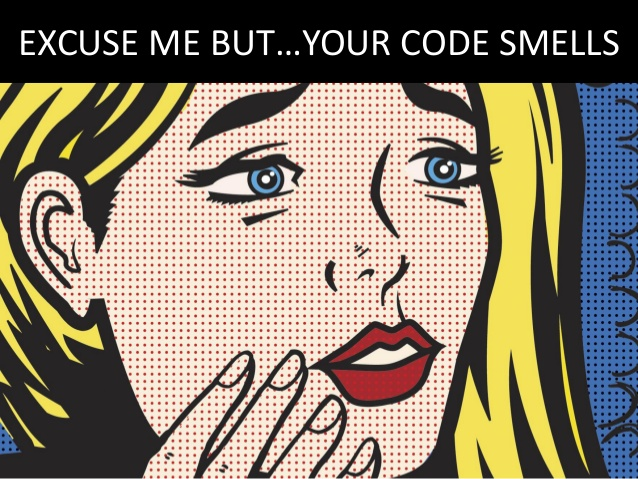

# Clean Code

## Aprende a escribir aplicaciones limpias y aumenta tu valor.

### Para TrainingIT

#### Por Alberto Basalo

# 📚 Tabla de contendido detallado de clean code

#### Clean Code aplicado para desarrollos limpios y rentables.

## 🏁 0 - Introducción

#### 🤢 0.1 - Perdona pero... tu código huele

#### ✅ 0.2 - Software que funciona

## 🏷️ 1 - Estilo y nombrado

#### ✨ 1.1 - Estilo y orden

#### 📏 1.2 - Tamaños y límites

#### 📫 1.3 - Definiciones con sustantivos

#### 💪 1.4 - Acciones con verbos

## 🔀 2 - Instrucciones, bloques y funciones

#### 👉 2.1 - Declaración, asignación e invocación

#### ➰ 2.2 - Estructuras repetitivas y condicionales

#### 🧩 2.3 - Funciones puras y métodos de clase

## 🗂️ 3 - Estructuras de datos.

#### 🗃️ 3.1 - Cohesion de primitivos

#### 🔱 3.2 - Condiciones y algoritmos

## 📦 4 - Objetos y lógica de negocio

#### 🧱 4.1 - Cohesión de funciones

#### ⚒️ 4.2 - Principios sólidos para finales flexibles

## ✒️ 5 - Artesanía del software.

#### 📝 5.1 - Hacer las cosas bien

#### ✒️ 5.2 - Disciplina y buenos hábitos

# 0 - Introducción

## Aprende a escribir aplicaciones limpias y aumenta tu valor.

> _"Los programas deben escribirse para que la gente los lea, y de paso para que las máquinas los ejecuten."_
>
> ✍🏼 Harold Abelson

Inicio mis cursos preguntando a los alumnos **¿Para quién escribes código?**. Asistiendo a un curso sobre Código Limpio y haciendo yo hincapié en el _quién_ de la pregunta se cuidan de contestar lo que muchos piensan: ~~_el código se escribe para un ordenador_~~.

Pero si fuese así, **¿Qué sentido tienen los diversos lenguajes de programación?** ¿Por qué hay tantos? ¿Por qué han evolucionado desde el bajo nivel del código máquina hasta los actuales lenguajes de alto nivel?

La respuesta a estas preguntas quedaría mucho más clara si hubiéramos hecho una mejor traducción al español de la palabra original inglesa <mark>language</mark>. Deberíamos referirnos a Java, PHP, C#, JavaScript como idiomas. De ese modo resultaría más natural decir que **_el código se escribe para una persona._**

Por supuesto que **también escribimos para las máquinas**. Pero esa es la parte fácil, porque ellas se encargan de decirte alto y claro que no entienden lo que escribes o que directamente es incorrecto.

Pero si aceptamos que inicialmente escribimos para personas, entonces cobrará sentido dedicar tiempo al estilo con el que escribimos. Y lo más importante, esforzarnos para hacernos entender por nuestros lectores. Esta es la clave del código limpio: **escribir pensando en el lector**.

Sobre todo porque casi siempre tu principal lector será tu yo del futuro.

## 🏁 Empezamos

Voy a dejarte unas instrucciones en un idioma humano para que las sigas y escribas mejor código.

1 - **Programar es expresar procesos con detalle en un lenguaje no ambiguo** que entiendan las máquinas.

2 - Pero también es **comunicar a otras personas la intención** de los procesos para ser corregidos, aumentados y mejorados.

3 - Las **técnicas de código limpio** ayudan a escribir programas sencillos de entender y evolucionar.

4 - La programación limpia es un arte que **se puede aprender y practicar.**

5 - En este **curso tutorial** te enseño las técnicas para escribir código fácil de leer y barato de mantener.

Pero las ventajas de escribir código limpio no terminan en el propio código. Adquirir **la disciplina para escribir código limpio te convierte en mejor profesional**. En un artesano o artesana del software.

> _"El código limpio parece escrito por alguien a quien le importa."_
>
> -- ✍️ **Robert C. Martin**

# 🤢 0.1 - Perdona pero... tu código huele

## Lo primero es admitir que todo código es mejorable.

> _"Primero hazlo, después hazlo bien y luego hazlo mejor."_
>
> -- ✍️ **Addy Osmani**

He escogido esta frase para empezar porque me siento completamente representado. Casi nunca he hecho nada bien a la primera.

Pero se empieza por hacer algo. Ya vendrá el tiempo de corregirlo. Y cuándo esté bien será el momento de mejorarlo.

Este es un ciclo sin fin. **Hacer, corregir mejorar**. En este curso hablamos de la última parte, de la mejora de lo correcto.

Hacer las cosas bien es lo mínimo, es lo que se espera de cualquier profesional. Si se hacen mal te pedirán que las corrijas o te pedirán que te apartes.

Si continúas en este negocio es porque lo haces bien. Pero puedes hacerlo mejor.

### Tu código es mejorable; y el mío también. 😳

Así pues debemos tener claro que todo código es mejorable. No es cuestión de humildad o arrogancia. Es una cuestión práctica.

### A ese código mejorable le decimos que... huele mal. 🤢

Para no hablar en términos de bien o mal, la industria ha adoptado los sinónimos sucio y limpio. Y continuando con la metáfora decimos que el código sucio huele mal.

> Perdone, le huele el código.

## 🥀 Con el tiempo empeora

### El software de hoy exige mantenimiento futuro.

El software es la parte moldeable de un sistema. En contraposición con la rigidez del hardware, **creamos software con la intención de que pueda cambiar** con el tiempo. Y este es un concepto crucial.

### Con el paso del tiempo, digamos que el olor va a peor.

Es como si se pudriese. **Los malos olores del código son dificultades** para su entendimiento y modificación. Y el entendimiento de cualquier código se desvanece en cuanto te levantas de la silla.

> "Cualquier código tuyo que no hayas mirado últimamente, es como si lo hubiese escrito otro."
>
> -- ✍️ **Ley de Eagleson**

Puede que el código putrefacto no sea obra tuya. Pero, en cualquier caso, habrá que limpiarlo, ¿no? Permíteme este video para decirte lo mismo con algo de humor.

[ 📺 😂 ¿Lo he puesto yo? ¿Estaba aquí? ... ](https://twitter.com/quinHD/status/1087817606923542528?s=20)

## 💈 Principios de mejora

El hacer bien el código se apoya en la corrección formal que te ofrecen compiladores, editores u otras herramientas. El hacerlo correctamente se valida en los tests automáticos y en la validación por parte de los usuarios. Pero, **¿Cómo se evalúan las mejoras?.**

🛁 Toca limpiar el código pero no de cualquier manera. A lo largo del tutorial verás técnicas, métricas y consejos que seguirán estos **Principios de Limpieza**:

1️⃣. Mostrar la **intención** y ocultar los detalles.

2️⃣. **Evitar** la globalización y el acoplamiento.

3️⃣. Separar **responsabilidades**.

4️⃣. Don't Repeat Yourself **(DRY)**

_... and last but no least ..._

5️⃣. Keep It Simple, (_not_) Stupid **(KISS)**

Si lo que queremos es que el código se entienda, entonces nunca jamás debemos complicarlo. **Escoge la opción más sencilla** siempre vez que puedas . Ya el universo se encargará de aportar complejidad.

# ✅ 0.2 - Software que funciona

## Mejora tu código sin miedo.

> _"Codifica como si la persona que mantendrá tu código fuera un psicópata violento que sabe dónde vives."_
>
> -- ✍️ **Martin Golding**

Nos cuesta hacer las cosas. Y mucho más hacerlas bien. ¿Y ahora nos dicen que las mejoremos? Ni loco 😵. ~~_Si funciona no lo toques_~~.

Claro, si ese código nunca hubiera que cambiarlo... conque se comporte correctamente es suficiente. Pero **más temprano que tarde habrá que mantenerlo** (aumentarlo, modificarlo o corregirlo). Y entonces, al que venga detrás no le importará tanto la función como el diseño.

## 🧪 Limpiar requiere cambiar por dentro sin cambiar por fuera

Mejorar, o limpiar en este _argot_, significa **reescribir para facilitar la modificación futura**. Por tanto, el cambio es inapreciable desde fuera. Hay que verlo por dentro para valorarlo.

Estamos ante **los dos principales enemigos del software** bien diseñado. Tengo algo que funciona; no me pagan por mejorarlo y además tengo el riesgo de estropearlo.

Vamos a atacar al segundo con un arma de destrucción masiva de quejas: **los tests**. Las pruebas del software son la principal garantía de que su funcionamiento es correcto con respecto a las especificaciones.

Entiendo que hacer tests es costoso, aburrido y puede parecer improductivo. Pero **no hacerlos es más costoso**, resolver bugs en producción es más estresante y a la larga todo es más caro.

_No quiero hacer tests!!_ Vale, pero tampoco abandones tu camino hacia el código limpio si aún no estás convecino del valor de las pruebas. Puedes, y **debes, mejorar igualmente tu código**. Aunque asumirás más riesgos. Te propongo que empieces poco a poco, tal como nos recomiendan los expertos:

- Necesitas pruebas para limpiar **tranquilo**.
- Haz algún tipo de prueba, pero **¡haz pruebas!**.
- En _front_, mejor empieza por **integración**.
- Los tests **son automáticos**.
- Los tests **deben estar limpios**.

> "[Write tests. Not too many. Mostly integration.](https://kentcdodds.com/blog/write-tests)"
>
> -- ✍️ **Kent C. Dodds**

### Si funciona...

Todo **el código de muestra de este curso va acompañado de sus tests**. En los laboratorios tienes todo lo necesario para ejecutarlos. Tanto si ya eres un maestro del testing como si estás empezando puedes mejorar el código y hacer las prácticas propuestas con tranquilidad.

Tras la broma, una pequeña reflexión de despedida del padre del **Clean Code**.

> _"¿Por qué los desarrolladores temen cambiar su código?_
>
> Porque ¡Tienen miedo a que se rompa!
>
> _¿Por qué tienen miedo de romperlo?_
>
> Porque no tienen pruebas.
>
> _Si funciona, y tienes pruebas, tócalo."_
>
> -- ✍️ **Robert C. Martin**
