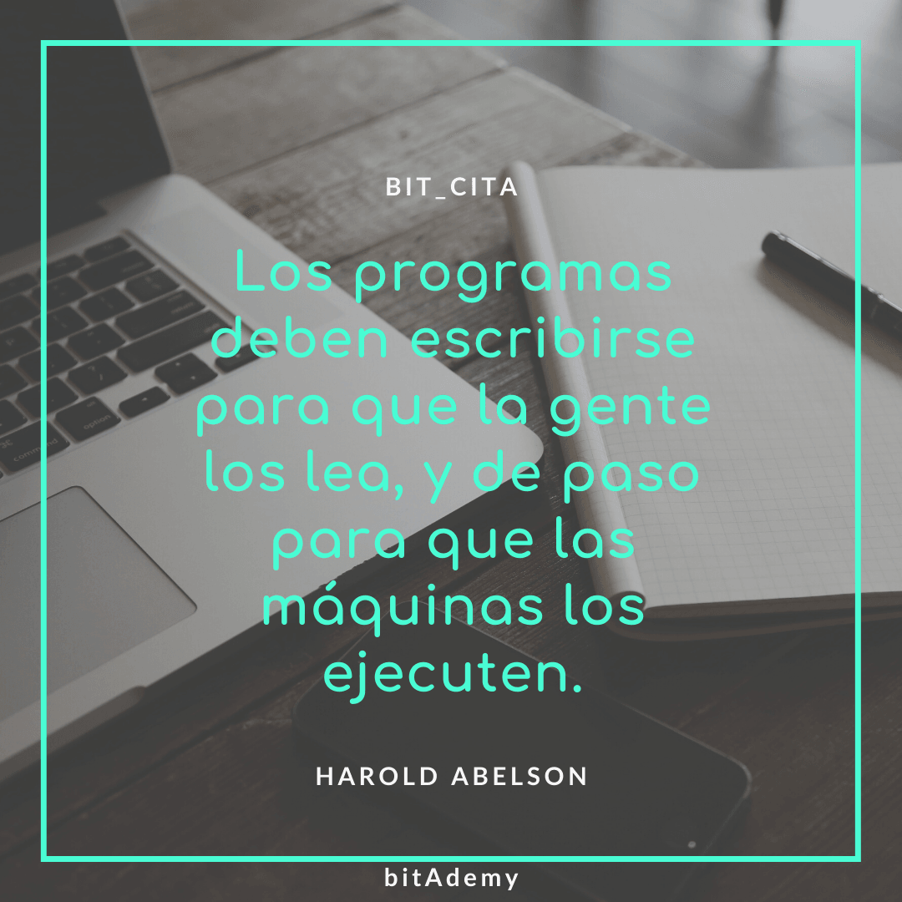

# Clean Code

## Aprende a escribir aplicaciones limpias y aumenta tu valor.

### Por [Alberto Basalo](https://www.linkedin.com/in/albertobasalo) para [bitAdemy](https://www.bitademy.com)

## Objetivos:

- Desarrollar aplicaciones **fáciles de mantener.**

- **Reducir la cantidad de errores** y facilitar su detección.

- Distinguir y aplicar las **buenas prácticas de programación**.

- Adoptar la **disciplina profesional** de un artesano del software.

## A quién va dirigido:

#### Programadores que conozcan alguno de estos lenguajes: Java, C#, JavaScript o TypeScript.

- 👨‍💻 Inicio mi carrera en la programación

- 👴 Mantengo código heredado

- 🙋‍♂️ Lidero un equipo

- 👨‍💼 Creo que puedo hacerlo mejor

## Contenido

- 📹: 4 horas de videos.

- 📖: 22 documentos guía en pdf.

- ⌨: 16 demostraciones en código.

- ✒ : 5 ilustraciones poster de referencia.

- 📋: 4 ejercicios prácticos propuestos y resueltos.

---

> _"El código limpio parece escrito por alguien que se ha preocupado de hacerlo bien. Alguien con más valía profesional."_
> -- Robert C. Martin "Uncle Bob"

# 📚 Índice de contenido

## 🏁 0 - Introducción.

#### 🤢 0.1 - Perdona pero... tu código huele

#### ✅ 0.2 - Software que funciona

## 🏷️ 1 - Estilo y nombrado

#### ✨ 1.1 - Estilo y orden

#### 📏 1.2 - Tamaños y límites

#### 📫 1.3 - Definiciones con sustantivos

#### 💪 1.4 - Acciones con verbos

## 🔀 2 - Instrucciones, bloques y funciones

#### 👉 2.1 - Declaración, asignación e invocación

#### ➰ 2.2 - Estructuras repetitivas y condicionales

#### 🧩 2.3 - Funciones puras y métodos de clase

## 🗂️ 3 - Estructuras de datos.

#### 🗃️ 3.1 - Cohesion de primitivos

#### 🔱 3.2 - Condiciones y algoritmos

## 📦 4 - Objetos y lógica de negocio

#### 🧱 4.1 - Cohesión de funciones

#### ⚒️ 4.2 - Principios sólidos para finales flexibles

## ✒️ 5 - Artesanía del software.

#### 📝 5.1 - Hacer las cosas bien

#### ✒️ 5.2 - Disciplina y buenos hábitos

## Preguntas frecuentes

No te quedes con dudas. Aquí están las respuestas

#### ¿Se incluye el IVA ?

Sí. En Europa los precios incluyen el IVA y se emite factura para cada compra.
Para América se ofrece libre de impuestos

#### ¿Qué formas de pago se admiten?

Tarjeta de crédito y PayPal (Sólo en América).

#### ¿Hay cupones descuento ?

Sí. Durante la cuarentena 😷 tenemos activado el cupón BIT_40. Asígnalo durante el proceso de pago para un descuento del 40%. Quédate en casa. 🏡

#### ¿Hay descuentos para grupos ?

Sí. Se pueden comprar cupones para obtener ventajas de escalado. Solicita información

#### ¿Cuánto tiempo puedo usar el curso?

Fácil, todo el tiempo. Cada curso se compra una sola vez y se puede visionar indefinidamente. Sin ataduras temporales. Con mejoras y actualizaciones incluidas para siempre.

#### ¿Cuánto tiempo me llevará completarlo?

Este es un curso intensivo. Según el nivel y el tiempo de práctica llevará entre 16 y 20 horas. Lo recomendable es dedicarle al menos 4 horas por semana y terminarlo en menos de un mes. Pero, recuerda, que lo tendrás aquí para siempre.

#### ¿Cuándo empiezo?

Ya. Cuando quieras. Cuando puedas. No dependemos de fechas inicio fin. No tienes que esperar por tus compañeros ni adaptarte a horarios.

#### Necesito más información

Escríbenos un correo electrónico a <learn@bitademy.com> y te ayudaremos en lo que necesites.

