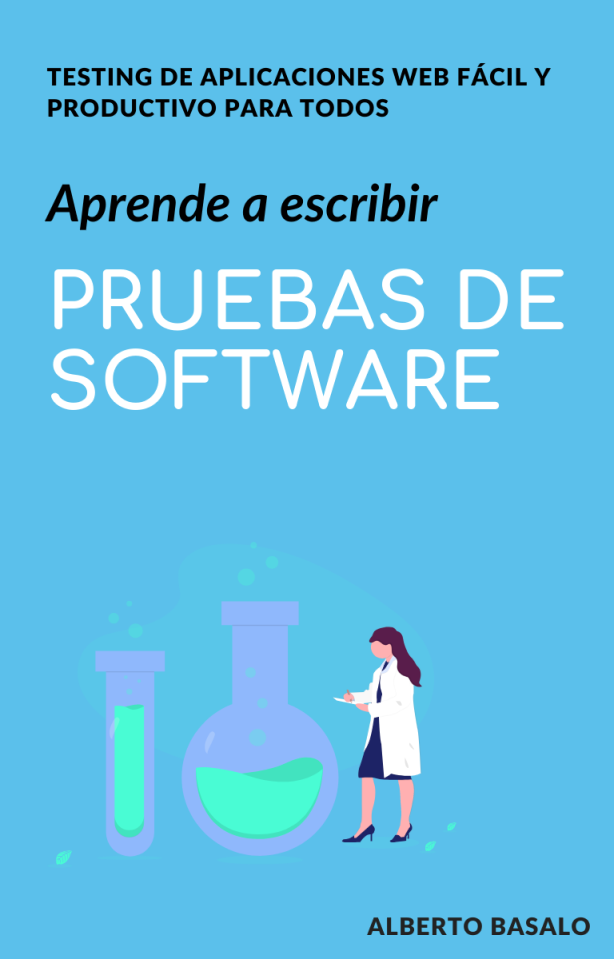

# Web Testing

## Aprende a probar tu código para ganar más confianza y tranquilidad.

### Por [Alberto Basalo](https://www.linkedin.com/in/albertobasalo) para [bitAdemy](https://www.bitademy.com)

## Objetivos:

- Conocer la terminología y la filosofía de los distintos **tipos de pruebas**.

- **Comprobar funcionalidades** con pruebas _end to end_ de aplicaciones web.

- **Refactorizar código _legacy_** con la tranquilidad de las pruebas unitarias y de integración.

- Crear **nuevo código correcto** bajo el paradigma _Test Driven Development_.

- **Conocer las principales herramientas** y para qué se usa cada una. _Puppeteer, Cypress y Jest._

## A quién va dirigido:

#### Programadores que conozcan alguno de estos lenguajes: Java, C#, JavaScript o TypeScript.

- 👨‍💻 Inicio mi carrera en la programación

- 👴 Mantengo código heredado

- 🙋‍♂️ Lidero un equipo

- 👨‍💼 Creo que puedo hacerlo mejor

## Contenido

- 📹: 6 horas de videos.

- 📖: 22 documentos guía en pdf.

- ⌨: 20 demostraciones en código.

- ✒ : 5 ilustraciones poster de referencia.

- 📋: 4 ejercicios prácticos propuestos y resueltos.

---

> _"Los desarrolladores no tienen que justificar las pruebas y la refactorización; porque esas disciplinas aumentan su eficiencia y la productividad"_
>
> -- ✍️ **Robert C. Martin**

# 📚 Índice de contenido

## 🏁 0 - Introducción al testing.

#### ✅ 0.1 - Software que funciona

#### 🔀 0.2 - Tipos de pruebas

#### 👨🏼‍🏫 0.3 - Filosofía y patrones

#### 👮🏼‍♀️ 0.4 - Comportamiento

# \_

## 🏷️ 1 - Primeras pruebas

#### 👼🏼 1.1 - Pruebas de funciones puras

#### 🧱 1.2 - Pruebas de integración con clases

#### 📦 1.3 - Pruebas unitarias

#### 🧬 1.4 - TDD, pruebas antes que el código

#### 🎪 1.5 - BDD, software basado en el comportamiento

## 🌐 2- E2E Pruebas externas de principio a fin

#### ⬛ 2.1 - Pruebas de aplicaciones web de caja negra

#### 🎃 2.2 - Puppeteer para pruebas de de contenido y visualización

#### 🚢 2.3 - Lighthouse para pruebas de rendimiento web

#### 🧩 2.3 - Pruebas de un API

# \_

## 🗂️ 3 - Pruebas funcionales de aplicaciones web con Cypress.

#### 🌲 3.1 - Cypress, instalación configuración y ejecución

#### 👩🏼 3.2 - Simulando el comportamiento de un usuario

#### 🤖 3.3 - Automatización e integración continua

# \_

## 🔬 4 - Pruebas de integración, unitarias y tdd con Jest

#### 💻 4.0 - Jest para probar tu código

#### 🐎 4.1 - Pruebas de integración

#### 🎠 4.2 - TDD el ciclo virtuoso RGR

#### 👨🏼‍🎨 4.3 - Diseño integrado

#### 👨🏼‍🎤 4.4 - Refactoring y rediseño

#### 🏇🏼 4.5 - Pruebas de código asíncrono

## Preguntas frecuentes

No te quedes con dudas. Aquí están las respuestas

#### ¿Se incluye el IVA ?

Sí. En Europa los precios incluyen el IVA y se emite factura para cada compra.
Para América se ofrece libre de impuestos

#### ¿Qué formas de pago se admiten?

Tarjeta de crédito y PayPal (Sólo en América).

#### ¿Hay cupones descuento ?

Sí. Durante la cuarentena 😷 tenemos activado el cupón BIT_40. Asígnalo durante el proceso de pago para un descuento del 40%. Quédate en casa. 🏡

#### ¿Hay descuentos para grupos ?

Sí. Se pueden comprar cupones para obtener ventajas de escalado. Solicita información

#### ¿Cuánto tiempo puedo usar el curso?

Fácil, todo el tiempo. Cada curso se compra una sola vez y se puede visionar indefinidamente. Sin ataduras temporales. Con mejoras y actualizaciones incluidas para siempre.

#### ¿Cuánto tiempo me llevará completarlo?

Este es un curso intensivo. Según el nivel y el tiempo de práctica llevará entre 16 y 20 horas. Lo recomendable es dedicarle al menos 4 horas por semana y terminarlo en menos de un mes. Pero, recuerda, que lo tendrás aquí para siempre.

#### ¿Cuándo empiezo?

Ya. Cuando quieras. Cuando puedas. No dependemos de fechas inicio fin. No tienes que esperar por tus compañeros ni adaptarte a horarios.

#### Necesito más información

Escríbenos un correo electrónico a <learn@bitademy.com> y te ayudaremos en lo que necesites.

